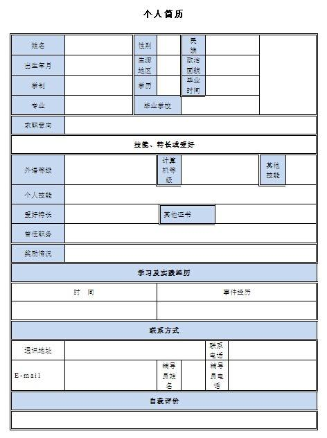

# HTML
HTML Courseware

## 一 HTML介绍

1. 什么是HTML？

2. [HTML]: https://developer.mozilla.org/zh-CN/docs/Web/HTML/Element

   超文本标记语言

3. HTML4.0 -> XHTML1.0 -> XHTML1.1 -> XML

4. HTML是由 标签和内容组成的

   [html]: https://www.w3schools.com/tags/tag_label.asp

   ```html
   <a href="http://www.baidu.com">baidu</a>
   <br />
   <A HREF="http://www.taobao.com">淘宝
   ```

   [主体结构]: ./1主体结构标签.html

   ```html
   <!DOCTYPE html><!--声明当前文档类型为HTML文档  这是一个H5的头-->
   <html>
   <head>
   	<!--设置字符编码-->
   	<meta charset="UTF-8">
   	<title>我就是标题</title>
   </head>
   <body>
   	<!--主体结构的代码-->
   </body>
   </html>
   ```

   [html主体结构]: ./2主体结构2.html	"html主体结构"

   

5. HTML中的注释的作用:

   1. 解释说明

   ```html
   <!DOCTYPE html><!--声明当前文档类型为HTML文档  这是一个H5的头-->
   <html>
   <head>
   	<!--设置字符编码-->
   	<meta charset="UTF-8">
   	<title>我就是标题</title>
   </head>
   <body>
   	<!--主体结构的代码-->
   </body>
   </html>
   ```

   1. 代码调试

6. HTML的注释

   <!--注释的内容-->

7. HTML标签的组成

   ```html
   <people hand="take" foot="walk" mouth="eat"></people>
   <!--仅作为解释，没有这个标签-->
   ```

   标签是由 < 和 >来组成

   分为：

   + 非封闭标签(单标签)   自闭合

   ```html
   <br>   <!--换行 插入换行符-->
   <dt>   <!--放在每个定义术语词前-->
   <dd>   <!--放在每个定义之前-->
   ```

   + 封闭标签(双标记)   有开始就要有结束

   ```html
   <title></title>   <!--设置文档的标题-->      
   <h1></h1> 				<!--最大的标题-->
   <pre></pre>     	<!--预先格式化文本-->      
   <u></u> 					<!--下划线-->
   <b></b>     			<!--黑体字-->
   <i></i>     			<!--斜体字-->
   ```

8. 注意

   + 双标记有开始就要有结束
   + HTML代码不区分大小写 但是统一小写

## 二 HTML中head头的设置

## 三 HTML的头的设置

H5:<!DOCTYPE html>

h4:<!DOCTYPE HTML PUBLIC "-//W3C//DTD HTML 4.01 Transitional//EN" "http://www.w3.org/TR/*html4*/loose.dtd">(了解)

[Html  head setting]: ./19head头中的了解的标签.html

##### (1)设置字符集

```html
<meta charset="utf-8">
```

##### (2)设置标题

```html
<title>标题</table>
```

##### (3)自动刷新

```html
<meta http-equiv="refresh" content="时间;url=地址">
```

##### (4) 关键字

```html
<meta name="keywords" content="关键字1,关键字2">
```

##### (5) 简介

```html
<meta name="description" content="简介,描述">
```

##### (6) 作者

```html
<meta name="author" content="名字">
```

##### (7) 导入css文件

```html
<link type="text/css" rel="stylesheet" href="文件">
```

##### (8) css代码

```html
<style type="text/css">	样式</style>
```

##### (9) js代码

```html
<script>	js代码</script>
```

##### (10) 导入js代码

```html
<script src="文件"></script>
```

##### (11) 设置网页的图标

```html
<link rel="icon" href="图片地址">
```

```html
<!DOCTYPE html><!--声明当前文档类型为HTML文档  这是一个H5的头--><html><head>	<!--设置字符编码-->	<meta charset="UTF-8">  <!--页面标题-->	<title>我就是标题</title>  <!---->  <meta http-equiv="refresh" content="3;url=http://www.baidu.com">  <!--关键字-->  <meta name="keywords" content="1,2">  <!--简介-->  <meta name="description" content="this is H5 page">  <!--作者-->  <meta name="author" content="Gerth Wang"  <!--导入css-->  <link type="text/css" rel="stylesheet" href="./demo1.css">  <style type="text/css">    #one {      width:  100px;      height: 100px;      border: 1px solid black;      background-color: red;    }</style>  <script>	alert('这里是脚本')</script>  <script src="./demo1.js"></script></head><body>	<!--主体结构的代码-->  <div id="one"></div>  <div id="two"></div>  </body></html>
```

```css
/*demo1.css*/#two {   width:  100px;  height: 100px;  border: 1px solid black;  background-color: #888888}
```

```javascript
//demo1.jsalert("这里是引入的脚本")
```


## 四 HTML中的文本标签 格式化标签

[html text tag]: https://developer.mozilla.org/zh-CN/docs/Web/HTML/Element#%E6%96%87%E6%9C%AC%E5%86%85%E5%AE%B9

#### (1) 文本标签

[]: ./3文本标签.html

1. \<i>\</i>   斜体   \<em>\<\em> 强调斜体

2. \<b>\</b> 加粗   \<strong>\</strong>   强调加粗

3. \<h1>-\<h6>  双标记  自占一行  字体加粗加大

4. \<sub>\</sub>  下标

5. \<sup>\</sup>  上标

6. \<del>\</del>     删除线

7. \<u>\</u>     下划线

   ```html
   我是第一行我是第二行<br>我是第第三行<!-- <br /> --><p>少小离家老大回</p><p>安能辩我是雌雄</p><!--斜体--><i>说斜就斜了</i><em>我也是斜体 强调斜体</em><br /><b>我加粗了</b><br /><strong>trong的强调加粗</trong><!--又粗又斜--><b><i>又粗又斜</i></b><br /><i><b>又粗又斜</b></i>
   ```

#### (2)标题标签

`<h1>` 级别最高，而 `<h6>` 级别最低

```html
<h1></h1><h2></h2><h3></h3><h4></h4><h5></h5><h6></h6>
```

[Html]: ./4标题标签.html

#### (3) 格式化标签

1. \<br /> 换行   单标记

2. \<p>\</p>  段落标签  自占一行  段落之间有间距

3. \<hr />      水平分割线

4. 列表

   + 无序列表

     [UL]: https://developer.mozilla.org/zh-CN/docs/Web/HTML/Element/ul

     + \<ul>\</ul>  无序列表
     + \<li>\<li>      列表项

     ```html
     <ul>  <li>first item</li>  <li>second item</li>  <li>third item</li></ul>
     ```

   + 有序列表

     [OL]: https://developer.mozilla.org/zh-CN/docs/Web/HTML/Element/ol

     + \<ol>\</ol>
     + \<li>\</li>

     ```html
     <ol>  <li>Mix flour, baking powder, sugar, and salt.</li>  <li>In another bowl, mix eggs, milk, and oil.</li>  <li>Stir both mixtures together.</li>  <li>Fill muffin tray 3/4 full.</li>  <li>Bake for 20 minutes.</li></ol>
     ```

     

   + 自定义列表

     [DL]: https://developer.mozilla.org/zh-CN/docs/Web/HTML/Element/dl

     + \<dl>\</dl>

     + \<dt>\</dt>  列表的头

     + \<dd>\</dd> 列表选项

       ```html
       <dl>	<dt>男装</dt>	<dd>衬衫</dd>	<dd>西装</dd>	<dt>女装</dt>	<dd>裙子</dd></dl>
       ```

       [exam]: ./6列表.html

5. 无意义的标签

   + \<div>\</div> 

     [div]: https://developer.mozilla.org/zh-CN/docs/Web/HTML/Element/div

   + \<span>\</span> 

     [span]: https://developer.mozilla.org/zh-CN/docs/Web/HTML/Element/span

     

     ```html
     <div></div> <!--是一个通用型的流内容容器(块级)--> <span></span> <!--元素是短语内容的通用行内容器（行级）-->
     ```

     [Exam]: ./7divspan.html
     [嵌套使用]: https://developer.mozilla.org/zh-CN/docs/Web/HTML/Element/ul

     

## 五 img图片标签

[]: https://developer.mozilla.org/zh-CN/docs/Web/HTML/Element/img

主体结构：

\

属性：

+ src  路径   (必须)
+ alt   图片加载失败时候的显示
+ title  提示信息
+ width   宽
+ height 高
+ border  图片的边框

```html
<!DOCTYPE html><!--固定的链接地址 称为绝对路径-->
```

[]: ./8img标签.html


## 六 a超链接

[html tag a]: https://developer.mozilla.org/zh-CN/docs/Web/HTML/Element/a

主体结构:

\<a> \</a>

属性：

+ href     链接跳转地址必须
+ target  打开方式
  + _blank  新建窗口   (必须有)
  + _self    本窗口打开(默认)
  + 以下三种用在分帧框架里
  + _parent  在父窗口打开
  + _top     顶级窗口打开
  + framename   窗口名
+ title      提示信息

锚点链接：

定义锚点:\<a id="锚点名">\</a>

使用锚点:\<a href="#锚点名">\</a>

```html
<a href="3文本标签.html" target="_self" title="去3.html">3文本标签.html</a><br \><a href="3文本标签.html" target="_blank" title="去3.html">3文本标签.html</a><br \><a href="9超链接.html" target="_self"  title="首页">首页</a><br \ ><a href="9超链接.html" target="_blank"  title="首页">首页</a><br \ ><a href="9超链接.html"  title="首页">首页</a><br \ > <!--站外链接--><a href="http://www.baidu.com" title="去百度">百度</a>
```


[A]: ./9超链接.html


## 七 table表格

主体结构：

\<table>

​	\<tr>

​		\<td>\</td>	\<td>\</td>	\<td>\</td>

​	\</tr>

\</table>

tr:代表行

td:代表每一行的单元格

th:列头标签  加粗居中

caption:表格标题

属性：

1. 单元格和内容之间的距离

   cellpadding

2. 单元格和单元格之间的距离

   cellspacing

3. 背景图片

   background  

4. 背景颜色

   bgcolor  

5. 合并行

   rowspan

6. 合并列

   colspan

7. 内容水平位置

   align:left/right/center

8. 垂直的位置

   valign:top/bottom/middle 

9. 边框

   border

10. 宽

    width

11. 高

    height

12. 边框颜色

    bordercolor

    ```html
    <!DOCTYPE html><html><head>	<meta charset="utf-8">	<title></title></head><body><!-- 1. 单元格和内容之间的距离   cellpadding2. 单元格和单元格之间的距离   cellspacing3. 背景图片   background  4. 背景颜色   bgcolor  5. 合并行   rowspan6. 合并列   colspan7. 内容水平位置   align:left/right/center8. 垂直的位置   valign:top/bottom/middle 9. 边框   border --><table bordercolor="blue" border="1" width="300" cellpadding="0" cellspacing="0" background="file:./2.jpg" height="300" align="center">	<caption><h2>table表格</h2></caption>	<tr >		<th>姓名</th>		<th>年龄</th>		<th>身高</th>		<th >体重</th>		<th  bgcolor="red">爱好</th>	</tr>	<tr>		<td valign="top">杨逸丰</td>		<td valign="bottom">20</td>		<td>174</td>		<td>60</td>		<td rowspan="2">写代码</td>	</tr>	<tr >		<td align="right">徐晓航</td>		<td colspan="2" align="center">23</td>		<td>65</td>	</tr></table></body></html>
    ```

    [<table>]: ./12table表格.html


细线表格

[]: ./13细线表格.html


## 八 实体化标签

`&lt;` 小于

`&gt;`大于

`&nbsp;` 空格

`&copy;` 

## 九 分帧框架

概述：是Ajax无刷新的前身  兼容性较好 

注意：分帧框架 不能和body体共存

主体结构：

```html
<frameset>	<frame name="窗口名称" src="连接地址"></frameset>
```

属性：

frameborder 值为1/0  是否显示边框

rows       		以行的形式分割你的当前frameset的窗口 多个值用逗号来隔开

cols    		以列的形式分割你的当前frameset的窗口 多个值用逗号来隔开

bordercolor    边框颜色

## 十 form表单

主体结构:

```html
<form></form>
```

form标签常用的属性：

+ action   数据提交的地址（不写地址默认提交当前页面）

+ method提交方式  （不写默认为get）

  + get   url地址栏可见长度受限制(IE2k 火狐8K) 相对不安全
  + post url地址栏不可见 长度不受限制  相对安全

+ enctype  提交类型(只有在做上传文件的时候才修改值)

  enctype="multipart/form-data"

#### input单行文本域

主体结构:

```html
<input type="类型" name="当前文本域的名字" value="默认值">
```

##### 常用的type属性的值：

+ text单行文本框

+ password  密码框

+ checkbox  复选框 (需要提供默认的value值)

+ radio         单选框

  ```html
  <label for="women">女</label><!--点击label 出发点击radio--><input type="radio" name="sex" id="women" value="w">
  ```

  注意：当radio单选框有多个选项的时候  要将name起同一个名

+ file             文件上传

+ button      普通按钮

+ submit       提交

+ reset           重置按钮(恢复当前页面到第一次打开时候的状态)

+ image          图片按钮的提交

+ hidden        隐藏域

##### 下拉选项：

主体结构：

```html
<select name="">  <option value="">显示的内容</option></select>
```


##### 常用其它属性：

name         表单里存储数据的name名

multiple    多选

size            输入框的宽度/下拉列表可见数目

maxlength 最大长度

checked      默认选中

selected      下拉列表的默认选中

placeholder 提示信息

readonly   只读

disabled      禁用

区别：

1. 只读后台依然能够获取到数据
2. 禁用相当于作废了  后台不能够获取到数据


##### 双标签:

```html
<button>	内容</button>
```

默认是submit提交类型

##### 属性:

type: submit/button/reset

#### 表单的其它作为了解的标签:

##### (1)表单分组

**fieldset** 将表单内的元素进行分组

**legend** 为分组起名

##### (2)下拉分组

**optgroup**

属性:label
